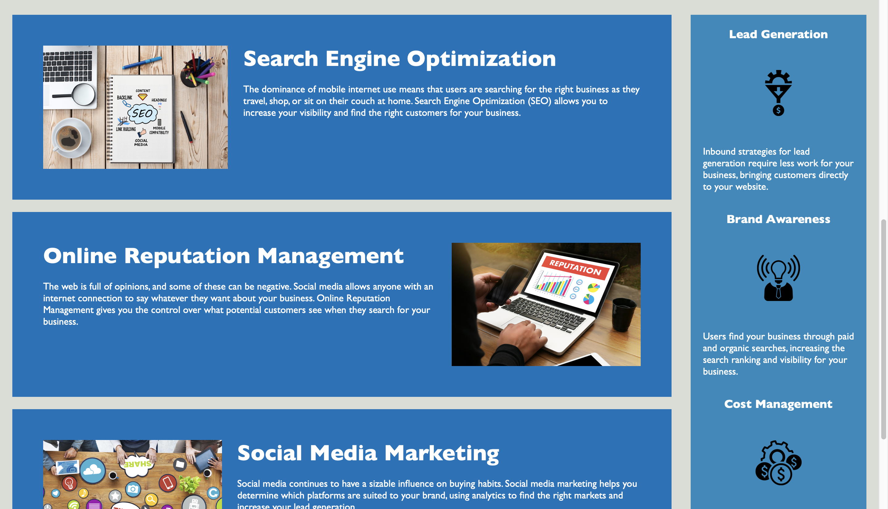
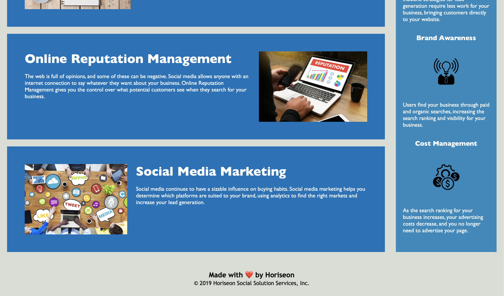

# week-1-homework
One of the most common tasks for front-end and junior developers is to take existing code and refactor it to either meet a certain set of standards or implement a new technology. Web accessibility is an increasingly important consideration for businesses, ensuring that people with disabilities and/or socio-economic restrictions have access to their website. Accessible websites are better optimized for search engines, and help companies avoid litigation.

For this week's Challenge, my task is to make thw web page accessible and to improve SEO. It's important to follow the Scout Rule when working with an existing codebase: Always leave the code a little cleaner than you found it. 

To impress the imaginary client for this Challenge, you should go the extra mile and improve their codebase for long-term sustainability. Ensure that all links are functioning correctly and clean up the CSS to make it more efficient, such as by consolidating CSS selectors and properties, organizing them to follow the semantic structure of the HTML elements, and including comments before each element or section of the page.

Remember when working with a client, it is essential to read the acceptance criteria for guidance and clarity on what the client expects, especially when asked to make a judgment call, such as when an icon needs an accessible alt tag and when it is okay to leave it blank. 


## Follow the following criteria 

```
GIVEN a webpage that meets accessibility standards

1. WHEN I view the source code
THEN I find semantic HTML elements
<article>
<nav> 

2. WHEN I view the structure of the HTML elements
THEN I find that the elements follow a logical structure independent of styling and positioning
I labelled different elements and selectors for other people to read more easily

3. WHEN I view the icon and image elements
THEN I find accessible alt attributes 
added short description for  alt attribute

4. WHEN I view the heading attributes
THEN I find that they fall in sequential order
I organized the codes accroding to the standards

5. WHEN I view the title element
THEN I find a concise, descriptive title
I gave a unique name to the webpage





Link to deployed application: https://kattheswagger1122.github.io/week-1-homework/


- - -
© 2022 Trilogy Education Services, LLC, a 2U, Inc. brand. Confidential and Proprietary. All Rights Reserved.
